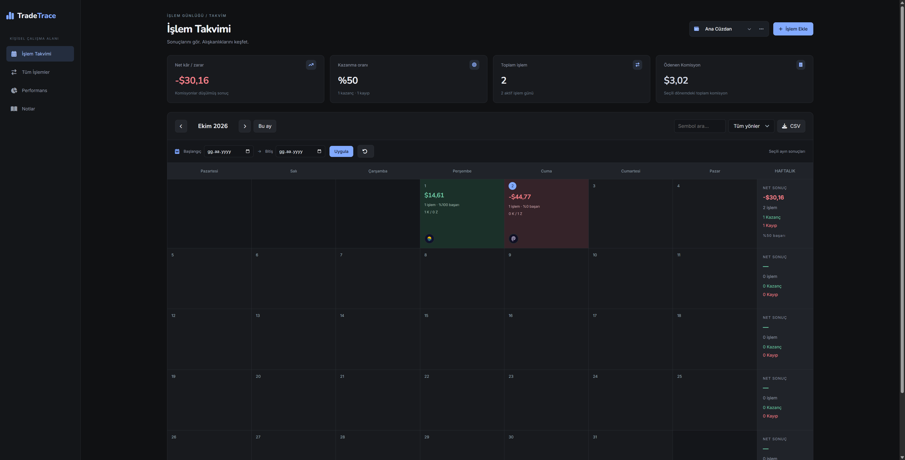
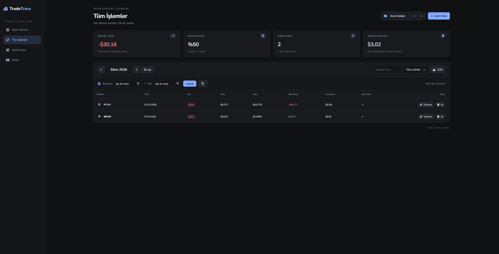
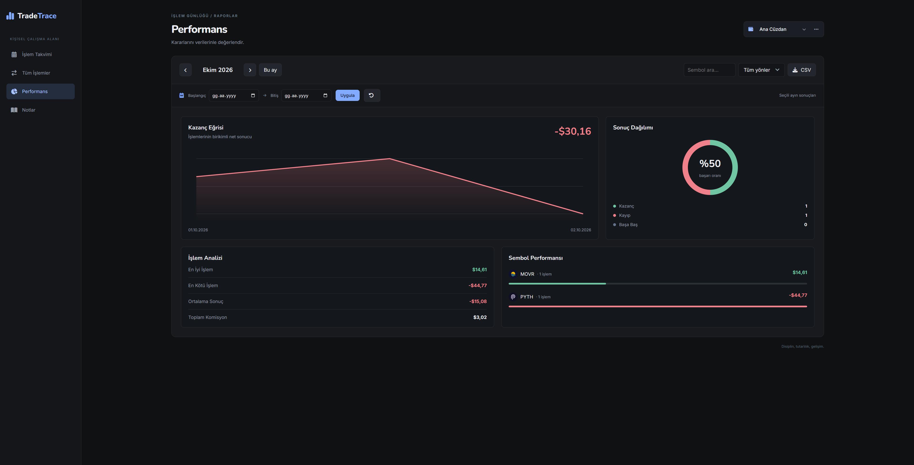
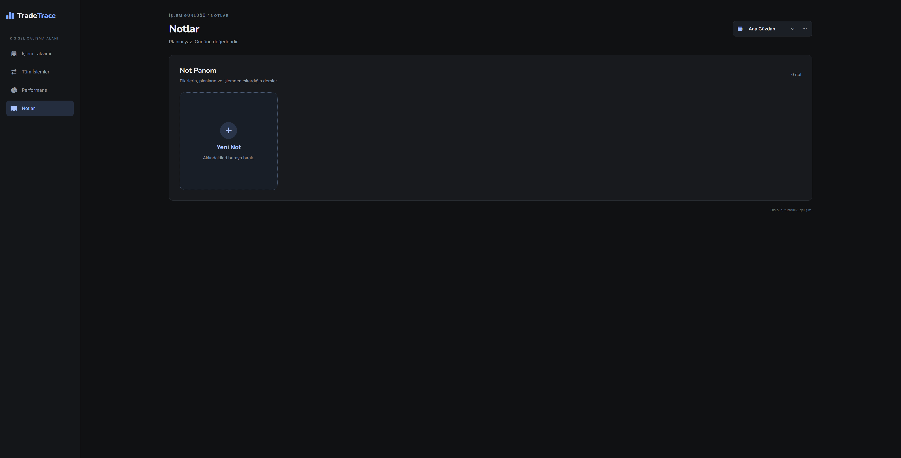

# Trade Trace
Trader kişilerin alım ve satım işlemlerini kaydedip analiz etmesini sağlar.

## Kurulum
`.env.example` dosyasını `.env` olarak değiştirin ve içindeki bilgileri kendinize göre düzenleyin.
Daha sonra aşağıdaki komutları çalıştırın.
```
npm install
npm run build
npm run start:production
```

## Kullanım
Projeyi çalıştırdığınızda aşağıdaki adrese bağlanıp kullanabilirsiniz.
```
http://localhost:3000/
```

## Not
Veritabanı olarak `MongoDB` gereklidir.

## Görseller




